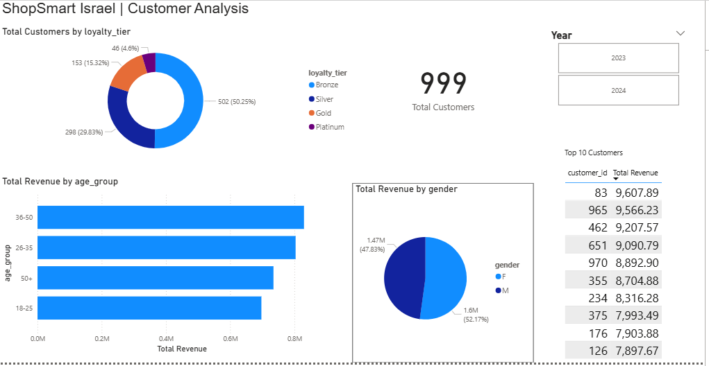
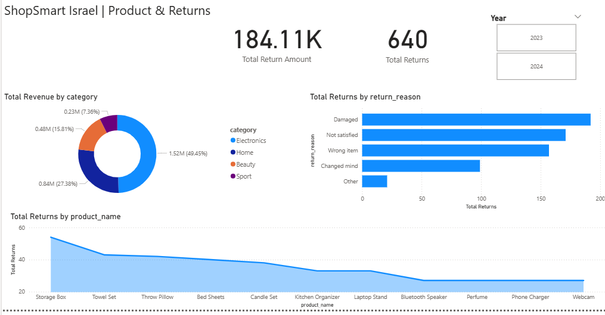

#  ShopSmart Israel — Retail Analytics Project

##  Project Overview
End-to-end data analytics project simulating real work as a Junior Data Analyst 
at a fictional Israeli e-commerce company "ShopSmart Israel".

##  Business Problem
The company's revenue is growing but profitability is declining. 
Management needs to understand:
- Who are our most valuable customers?
- Which product categories drive the most revenue?
- Why are customers returning products?
- What are the seasonal trends in sales?

##  Tools Used
| Tool | Purpose |
|---|---|
| Python (pandas) | Dataset generation & EDA |
| SQL Server (SSMS) | Data analysis & KPI queries |
| Power Query | ETL & data transformation |
| Power BI | Interactive dashboard |
| Excel | Initial data exploration |
| GitHub | Version control & portfolio |

##  Dataset
Realistic synthetic dataset generated with Python:
- **orders** — 8,000 rows
- **customers** — 1,000 rows  
- **returns** — 640 rows
- **Date range:** 2023–2024
- **Total Revenue:** ₪3,065,651

##  Key Insights
-  **Electronics** is the top category generating 49% of total revenue
-  **South region** leads all regions with ₪718,397 in revenue
-  **November** is the peak month (Black Friday effect)
-  **Age group 36-50** generates the highest revenue
-  **Return rate is 8%** — Damaged items are the top return reason
-  **Average Order Value: ₪383**

##  Dashboard Screenshots

### Page 1 — Executive Overview
page1_executive.png

### Page 2 — Customer Analysis

### Page 3 — Product & Returns

##  Project Structure
shopsmart-retail-analytics/
├── generate_dataset.py        # Python dataset generator
├── shopsmart_sql_analysis.sql # 10 SQL analytical queries
├── page1_executive.png        # Dashboard screenshot
├── page2_customers.png        # Dashboard screenshot
└── page3_products.png         # Dashboard screenshot

